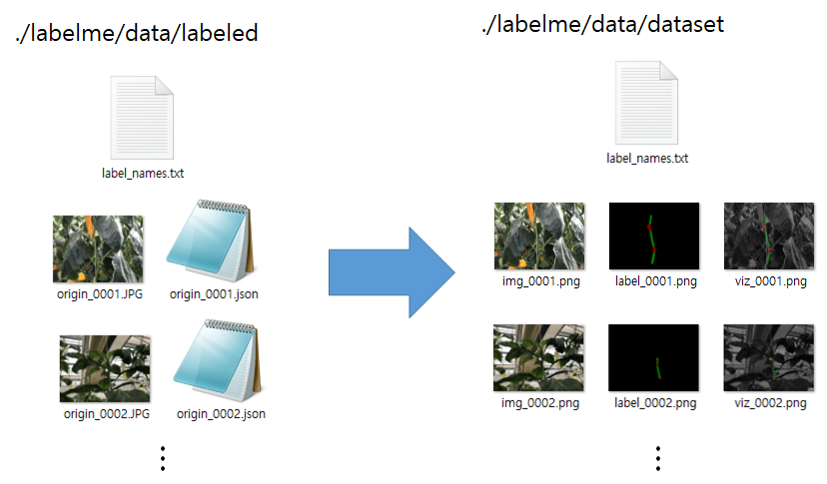

# Reference
https://github.com/wkentaro/labelme


# Annotation
```
# change dir to label dataset
cd tools/labelme/data/labeled

# excute labelme for annotation
labelme ./ --labels label_names.txt
```

# json2dataset

make multi json file to dataset

```
* json dir    :   ./tools/labelme/data/labeled
* dataset dir :   ./tools/labelme/data/dataset
```


