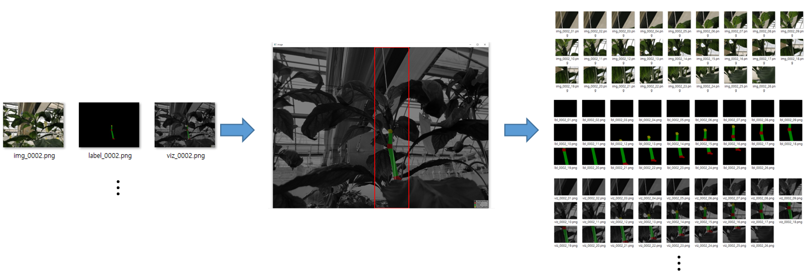

# Reference
https://github.com/wkentaro/labelme


# Annotation
```
# change dir to label dataset
cd tools/labelme/data/labeled

# excute labelme for annotation
labelme ./ --labels label_names.txt

# you can save result to .json file
```

# json2dataset.py

## make multi json file to dataset

```
* json dir    :   tools/labelme/data/labeled
* dataset dir :   tools/labelme/data/dataset
```


# crop_continue.py

## Crop the datatset along the y-axis

```
* dataset dir       :  tools/labelme/data/dataset
* crop_continue dir :  tools/labelme/data/crop_continue
```

```
* mouse left button : draw a rectangle on the clicked center
* 'e' key : erase the rectangle
* 's' key : crop the image along the rectangle
* 'd' key : go to the next image
* 'a' key : go to the previous image
* 'esc' key : exit program
```

